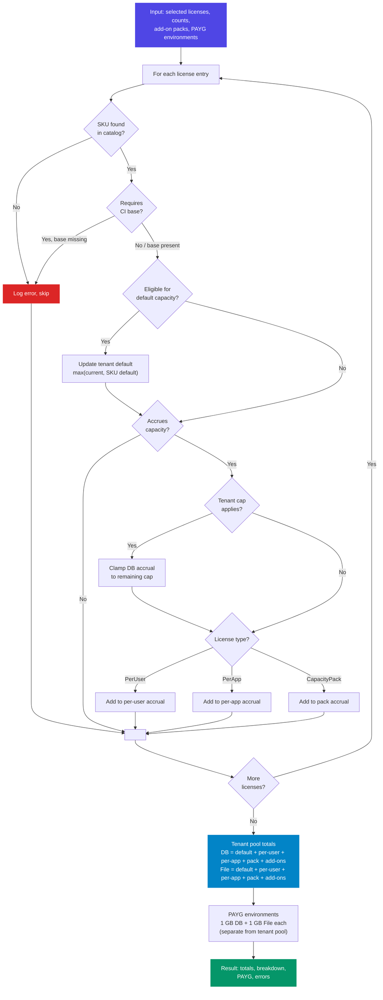

# Dataverse Capacity Calculator

An interactive web-based calculator for estimating Microsoft Dataverse capacity based on Power Platform and Dynamics 365 product licenses.

Entitlement source month: August 2026.

[**OPEN CALCULATOR**](https://dataverse.licensing.guide/)

[Read intro blog post](https://licensing.guide/december-2025-dataverse-default-capacity-changes-illustrated/)


## Features

- **Interactive Product Selection**: Choose from all major Dynamics 365 and Power Platform products
- **Real-time Calculations**: See capacity updates instantly as you add products and adjust user counts
- **Visual Capacity Gauges**: Clear visualization of default vs. per-user capacity allocation
- **Detailed Breakdown Table**: Line-by-line breakdown of capacity contributions
- **Helpful Tooltips**: Hover over products to see capacity details
- **"How it Works" Guide**: Built-in explanation of Dataverse capacity licensing
- **Mobile Responsive**: Works on desktop and mobile devices
- **Print-friendly**: Clean output for printing or sharing

## Capacity Calculation

> The calculator currently focuses primarily on Database + File capacity; Log support is not yet implemented. All estimates should be verified against the Power Platform admin center and the current Microsoft licensing guides.


### How Capacity Works

1. **Default Capacity**: When you license any Dataverse product, your tenant receives a one-time default capacity allocation. The highest tier product determines this amount.

2. **Per-User Accrual**: Many products add additional capacity for each licensed user. This stacks across all products.

3. **Tier Priority** (highest to lowest):
   - D365 ERP Premium (125 GB DB / 110 GB File)
   - D365 ERP Standard (90 GB DB / 80 GB File)
   - D365 CRM (30 GB DB / 40 GB File)
   - Power Platform Premium (20 GB DB / 40 GB File)
   - Power Platform Workload (15 GB DB / 20 GB File)

### Calculation Logic



## Development

### Prerequisites

- Node.js 18+ 
- npm

### Getting Started

```bash
# Install dependencies
npm install

# Start development server
npm run dev

# Build for production
npm run build

# Preview production build
npm run preview
```

### Tech Stack

- **React 18** - UI framework
- **Vite** - Build tool and dev server
- **Tailwind CSS** - Utility-first CSS framework

## Deployment

The site automatically deploys to GitHub Pages when changes are pushed to the `main` branch via GitHub Actions.

**Live Site**: [https://dataverse.licensing.guide/](https://dataverse.licensing.guide/)

## MCP Server

This repo also includes a deployable MCP server in [`mcp-server/`](./mcp-server/).

The MCP implementation uses the same deterministic calculation engine as the web UI, so the capacity numbers stay aligned across:

- the public calculator
- local `stdio` MCP clients such as VS Code or Claude Desktop
- remote HTTP MCP deployments behind a reverse proxy

The MCP package now exposes two transports:

- `src/index.js` for local `stdio` clients
- `src/http.js` for stateless Streamable HTTP deployments

The hosted HTTP deployment can also expose multiple MCP profiles from the same server, such as:

- a full profile for capable MCP clients
- a narrowed compatibility profile for clients like Copilot Studio

Public hosted endpoints for this repo:

- Health: `https://mcp.licensing.guide/health`
- Full MCP profile: `https://mcp.licensing.guide/mcp`
- Copilot Studio compatibility profile: `https://mcp.licensing.guide/copilot-mcp`

Use `https://mcp.licensing.guide/mcp` for capable MCP clients and `https://mcp.licensing.guide/copilot-mcp` for Copilot Studio.

The separate Copilot Studio profile exists because the initial Copilot Studio connection completed handshake traffic against the full `/mcp` endpoint but did not surface tools, while server logs confirmed successful requests from the Copilot Studio client. The working conclusion was that Copilot Studio was more sensitive to the richer nested schemas on the full profile, so the safer fix was to add a narrowed compatibility profile instead of weakening the main MCP surface for other clients.

That means other operators can deploy the MCP server on their own infrastructure without depending on the public hosted endpoint, while still preserving a richer API surface for some clients and a safer fallback for others. For setup details, see [`mcp-server/README.md`](./mcp-server/README.md).

## Disclaimer

This calculator provides estimates based on publicly available licensing information from the August 2026 Microsoft licensing guides. It focuses primarily on Dataverse Database + File capacity unless Log support is implemented. Always verify actual entitlements in the [Power Platform Admin Center](https://admin.powerplatform.microsoft.com/) and current Microsoft licensing guides.

## Resources

- [Microsoft licensing guides and docs](https://licensing.guide/resources/)
